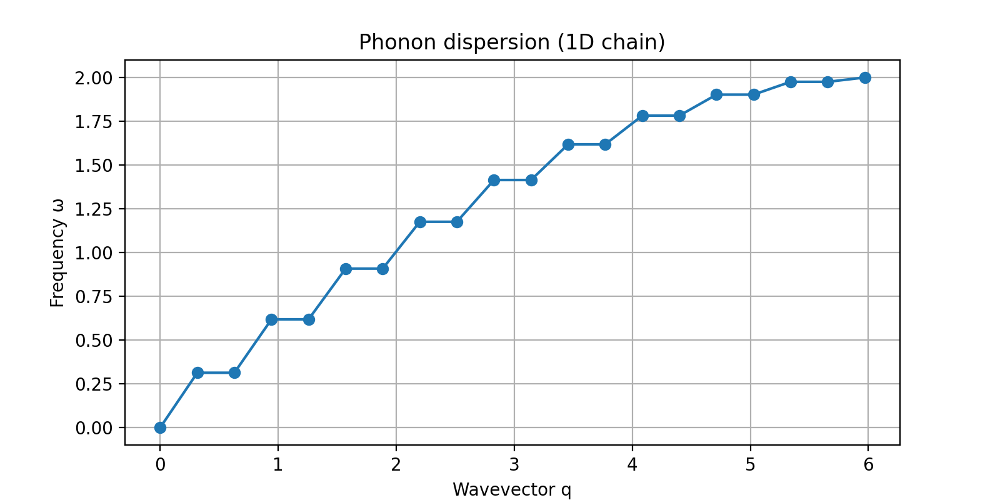

# Lattice-Dynamics

## Abstract

This project presents a numerical study of one-dimensional lattice dynamics using a chain of atoms coupled by harmonic springs. The system is modeled with periodic boundary conditions, and its time evolution is simulated through the velocity Verlet integration method. A small initial perturbation is introduced to generate collective vibrations across the lattice. The program computes and visualizes both the atomic displacements over time and the phonon dispersion relation obtained from the dynamical matrix. In addition, an animated representation of lattice vibrations is produced to illustrate the propagation of vibrational modes. The results provide a computational framework for exploring phonon dynamics, normal modes, and energy transport in crystalline solids

# Lattice Dynamics Simulation

This project simulates **1D lattice vibrations** in a chain of atoms connected by harmonic springs.  
It demonstrates how phonon modes arise from collective atomic oscillations and how their dynamics evolve in time.

## Features
- **Numerical Integration**  
  Time evolution of the system using the velocity Verlet method.

- **Normal Mode Analysis**  
  Calculation of eigenfrequencies and eigenvectors from the dynamical matrix.

- **Visualization**  
  - Atomic displacements over selected times.  
  - Phonon dispersion relation (frequency vs. wavevector).  
  - Animated GIF of lattice vibrations.
 
  - 

 **Output**  
  All results (figures and animation) are saved in the `figures_lattice/` directory.

## Requirements
- Python 3.7+
- NumPy
- Matplotlib (with Pillow for GIF export)

**Install dependencies:**  pip install numpy matplotlib pillow

**For usage:** Run the script Lattice Dynamics.py
# Parameters:

You can modify physical and numerical parameters directly in the script:
N = 20        # number of atoms
m = 1.0       # mass of each atom
k = 1.0       # spring constant
a = 1.0       # lattice spacing
dt = 0.05     # time step
n_steps = 400 # total number of steps

# Applications:

1. Educational visualization of phonons in solid-state physics.

2. Demonstration of normal mode analysis in coupled oscillators.

3. Foundation for more advanced lattice dynamics and thermal transport simulations.

# License

This project is released under the MIT License.
